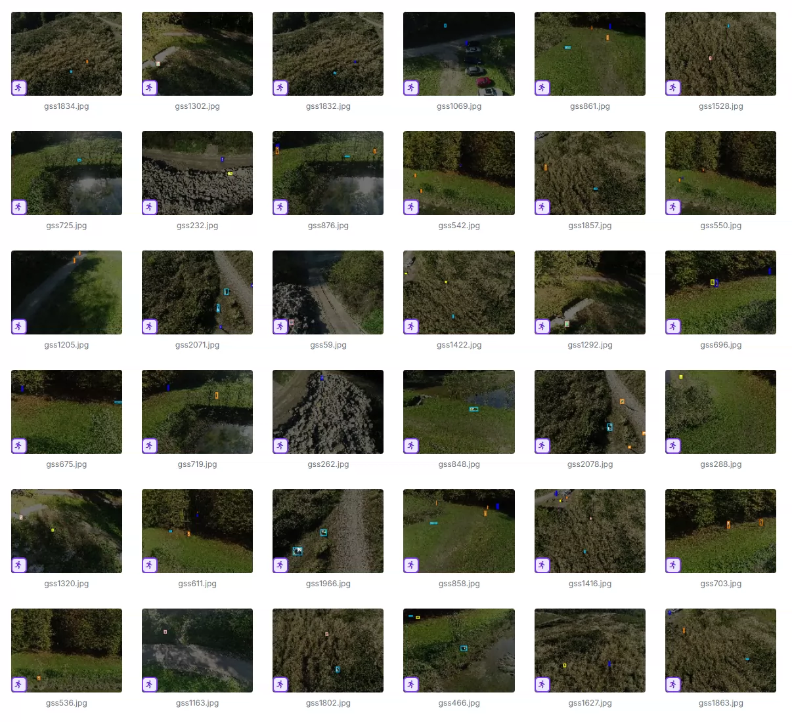
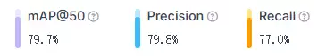
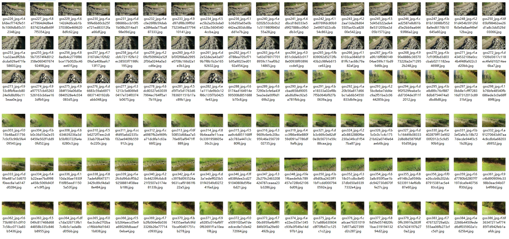
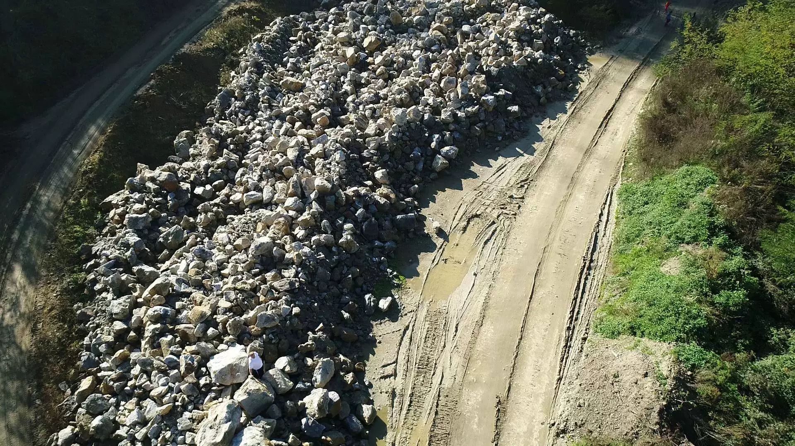
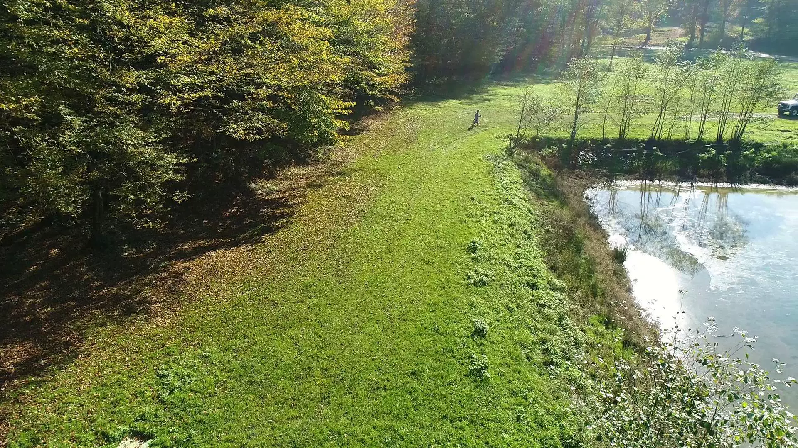
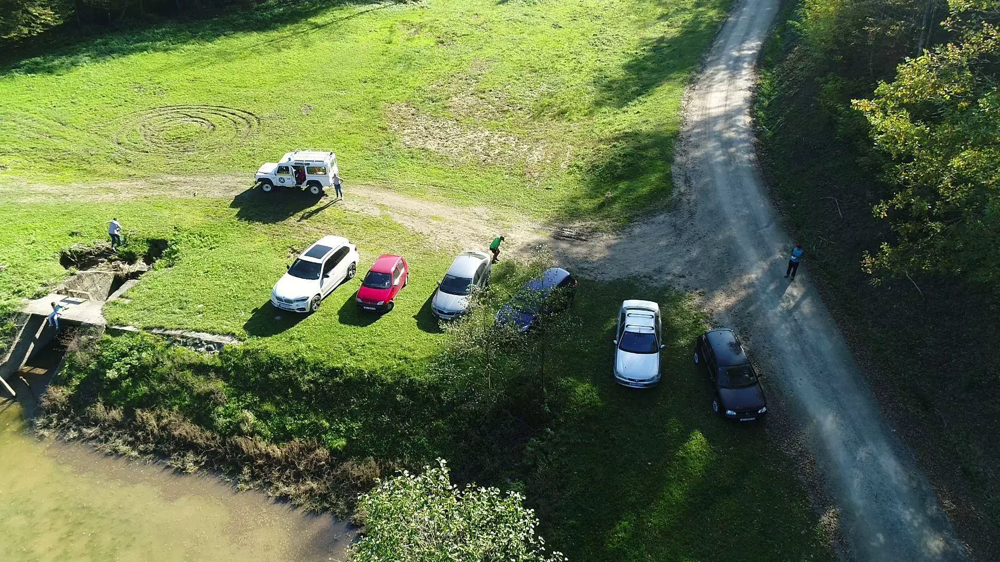

## Body

Drone Search and Rescue Dataset - YOLO format

Total 1980 images, labeled with tags and divided into training set, test set, validation set.

The dataset is divided into 6 categories: 'Running', 'Walking', 'lying_down', 'not_defined', 'seated', 'stands'

"Running", "Walking", "Lying Down", "Not Defined", "Seated", "Stands"

Electronic virtual products sold are not returnable.

## Images

item_1046767493892

Here is a pay link on Stripe ( https://buy.stripe.com/3cs8yP7sY87d0vu9AB ). Please contact me lonlonago@foxmail.com after funding $89, and I will send you a complete data files , thank you!

